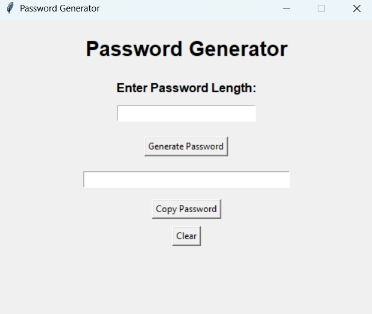
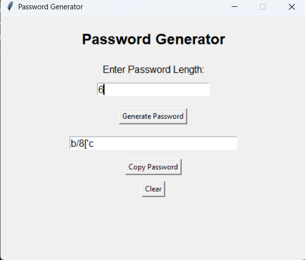

# 🔐 Password Generator
A python-based password generator application that creates strong and secure passwords using customizable options like length, numbers, and special characters.

# 📌 Project Overview
The Password Generator is a desktop application developed using Python and Tkinter. It allows users to generate strong and random passwords by entering the desired password length. The application provides a simple graphical user interface (GUI) that is easy to use and suitable for beginners.

# ✨ Features
- Generate strong and random passwords
- Simple and user-friendly Tkinter GUI
- Copy generated password
- Clear input and output fields
- Input validation for empty and invalid entries

# 🛠️ Technologies Used
- Python
- Tkinter (GUI)

# 📂 Project Structure
Password_Generator
│── password_generator.py
│── README.md
│── requirements.txt
│── images
   ├── home.png
   ├── generated_password.png
   ├── error_messages.png
   ├── error pages.png
   └── password copied.png

# ▶️ How to Run
1. Download or clone the project.
2. Open the project folder in VS Code.
3. Run the `password_generator.py` file.
4. Enter the password length.
5. Click **Generate Password**.
6. Copy or clear the generated password using the available buttons.

# 📷 Output

# home page

# generated password

# password copied

# error messages
.png)
.png)
.png)

# error page

# 📚 Future Enhancements
- Add password strength indicator
- Allow users to select password types (letters, numbers, symbols)
- Add dark mode
- Improve GUI design

# 👩‍💻 Author
Garima Singh

## ✅ Conclusion
The Password Generator project was successfully developed using Python and Tkinter. It provides a
simple and user-friendly graphical interface for generating strong and random passwords. The application includes password generation, input validation, copy, and clear functionalities, making it easy to use. This project helped in understanding Python programming, GUI development with Tkinter, event handling, and basic application design. It also demonstrates how Python can be used to build practical desktop applications.
